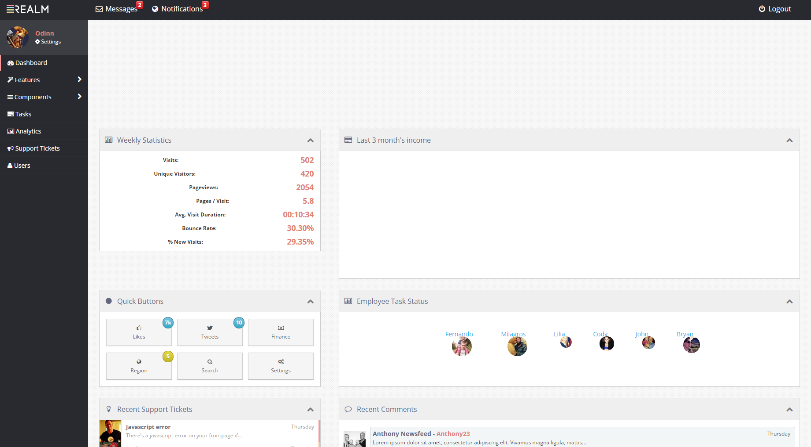

## Theme collection

###### Backend
---

>
>
>
>
>
>
>
>
>
>
>
>
>
>
>
>
>
>
>
>
>
>
>
>
>
>
>
>
>
>
>
>
>
>
>
>
>
>
>
>
>
>
>
>
>
>
>
>
>
>
>
>
>
>
>
>
>
>
>
>
>
>
>
>
>
>
>
>
>
>
>
>
>
>
>
>
>
>
>
>
>
>
>
>
>
>
>
>
>
>
>
>
>
>
>
>
>
>
>
>
>
>
>
>
>
>
>
>
>
>
>
>
>
>
>
>
>
>
>
>
>
>
>
>
>
>
>
>
>
>
>
>
>
>
>
>
>
>
>
>
>
>
>
>
>
>
>
>
>
>
>
>
>
>
>
>
>
>

###### frontend
---

> 
>