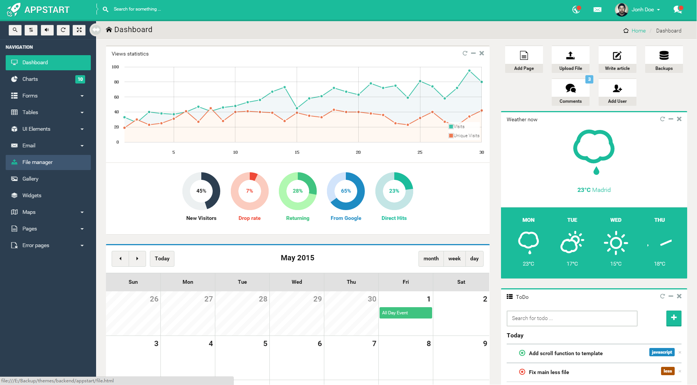

## Theme collection

###### Backend
---

> 
>
> 
>
> 
>
> 
>
> 
>
> 
>
> 
>
> 
>
> 
>
> 
>
> 
>
> 
>
> 
>
> 
>
> 
>
> 
>
> 
>
> 
>
> 
>
> 
>
> 
>
> 
>
> 
>
> 
>
> 
>
> 
>
> 
>
> 
>
> 
>
> 
>
> 
>
> 
>
> 
>
> 
>
> 
>
> 
>
> 
>
> 
>
> 
>
> 
>
> 
>
> 
>
> 
>
> 
>
> 
>
> 

###### frontend
---

> 
>